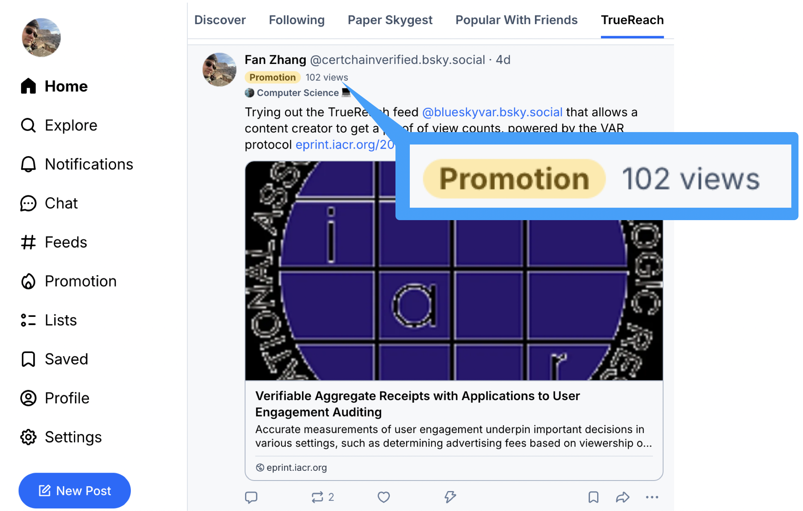
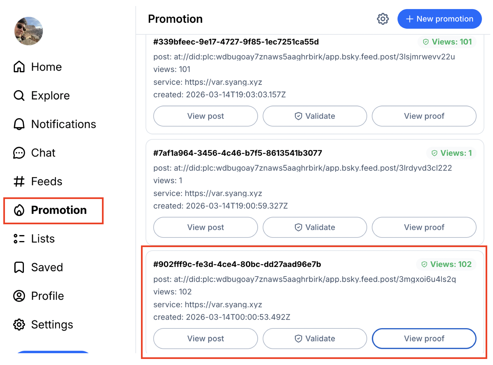
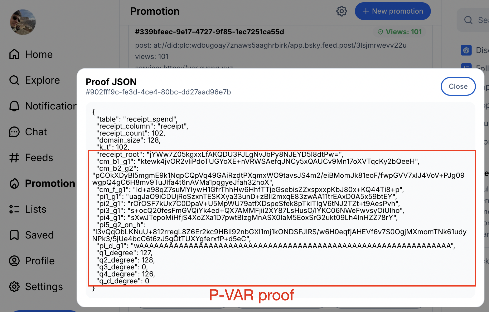

<div class="paper-meta">
  <div class="paper-authors">
    <strong>Ioannis Kaklamanis<sup>1</sup></strong>,
    <strong>Wenhao Wang<sup>1</sup></strong>,
    <strong>Harjasleen Malvai<sup>2</sup></strong>,
    <strong>Fan Zhang<sup>1</sup></strong>
  </div>

  <div class="paper-affiliations">
    <div><sup>1</sup> Yale University, IC3</div>
    <div><sup>2</sup> UIUC, IC3</div>
  </div>

  <div class="paper-links">
    <a class="btn btn-primary paper-link-btn" href="https://eprint.iacr.org/2025/2330">ePrint</a>
    <a class="btn btn-primary paper-link-btn" href="https://eprint.iacr.org/2025/2330.pdf">PDF</a>
    <a class="btn btn-primary paper-link-btn" href="https://bsky.hackingdecentralized.com/">Live Demo</a>
    <!-- <span class="btn btn-primary paper-link-btn disabled" aria-disabled="true">Code coming soon</span> -->
    <!-- <span class="btn btn-primary paper-link-btn disabled" aria-disabled="true">Slides coming soon</span> -->
  </div>
</div>

<div class="article-callout tldr-callout">
  <p><strong>Verifiable Aggregate Receipts (VAR)</strong> provide a framework for privacy-preserving auditing of aggregate service delivery: a platform can prove how many users it actually served without revealing which users participated. The paper presents two constructions with different efficiency and precision tradeoffs, and <strong>TrueReach</strong> demonstrates how these techniques can be applied to auditable view-count verification on Bluesky.</p>
</div>

## The Problem

**Delegation** is a common practice in modern economies: a delegator pays an intermediary to deliver services or information to end users.
This spans from content creators relying on social media platforms to reach followers, to corporate outsourcing of employee benefits
administration to external providers.
However, the party *paying for the service* often has **no trustworthy way to verify** how many users were actually served. For example:

- In content economy platforms (e.g., social networks), a creator may pay for boosted views, but has little visibility into whether the promised number of views was actually delivered or simply self-reported.
- In sponsored health programs, a provider may claim reimbursement for serving a certain number of patients, creating a direct incentive to inflate counts if there is no reliable auditing mechanism.

<div class="article-callout">
  <p>Across these settings, a <strong>fundamental security problem</strong> is to verify service quality, e.g., how many eligible users were reached or how many employees were actually served.</p>
</div>

## Verifiable Aggregate Receipts (VAR)

**VAR** is the paper's answer to that gap. With VAR, a **platform** is given a *receipt* by users when they are served, and a **verifier** can cryptographically verify the number of receipts possessed by the platform through an interactive protocol.

That proof should be **hard to fake** (*inflation soundness*), should **not reveal which individual users were involved** (*privacy from verifier*), and should still be **practical at the scale of millions of users**.

- **Inflation soundness**: a prover should not be able to claim more engagement than it actually earned.
- **Privacy**: the verifier should learn only the count, not individual identities beyond what can be inferred from the count.
- **Deniability**: We do not want users to sign over their interactions with the platform, because that would violate the deniability offered by most Internet applications.
- **Scalability**: we aim to efficiently support *millions* of users.

For those familiar with anonymous credentials, the core of VAR can be viewed as an *aggregatable* form of *one-show anonymous credentials*, though our constructions do not directly build on anonymous credentials.


### Two Constructions

The paper presents **two complementary constructions**.

- `S-VAR` is the *secret-sharing-based* construction. Its strength is **simplicity** and **efficiency in issuance**; it is a good fit when *fuzzy thresholds* are acceptable and fast issuance matters.
- `P-VAR` is the *pairing-based* construction. Its strength is **exact auditing** and **faster proof generation**, making it the stronger option when precise counts and fast audits are the priority.


The secret-sharing intuition is especially elegant: if reconstructing a secret requires **enough shares**, then successfully reconstructing it acts as evidence that the prover collected **enough receipts**.


We refer readers to [the paper](https://eprint.iacr.org/2025/2330) for details.

### Performance

The proposed constructions are **practical**, and they significantly outperform **baseline approaches** for large-scale audits.
For **one million users**, the paper reports:

- **less than 2 seconds** for issuance in both schemes,
- **about 34 seconds** for proving with the secret-sharing-based construction,
- **about 9.7 seconds** for proving with the pairing-based construction.


## Application: TrueReach on Bluesky

We extended the Bluesky protocol with a feature we call **TrueReach**, where a content creator can use VAR to **cryptographically verify view counts**.

### What is Bluesky, and why building VAR on it?

**Bluesky** is a decentralized social network built on [AT Protocol](https://atproto.com/), which separates *data hosting*, *content propagation*, *ranking*, and *presentation* into independent components.

In AT Protocol, creators publish content to Personal Data Servers (PDSs), which store user data and posts. Relays then propagate updates from PDSs across the network so that downstream services can access new content. Based on these updates, feed generators apply ranking logic and produce customized feeds that users can subscribe to. Finally, app views retrieve ranked results from user-selected feeds and present them to users.


Feed generators in AT Protocol act as **recommendation algorithms**: they select and rank content, and users can subscribe to different ranking services. This creates a promotion model in which creators may pay feed generators to increase content visibility. However, creators have **no way to verify** whether a feed generator actually delivered the promised exposure to users. **This lack of verifiability motivates applying the VAR protocol, which enables auditable proof that promoted content was delivered as agreed.**


### Integrating VAR with BlueSky

Our goal is to implement **TrueReach** so that the feed generator functions like a **regular feed generator** for general users, while providing **verifiable views** for content creators and users who join the protocol. The core of our implementation is a **feed generator** and a **custom app view** that support this functionality.

From a user's point of view, the workflow is as follows.


#### 1. Setup

When users join **TrueReach**, they generate a **public/private key pair** and send their public key together with their DID to the feed generator. The whole process is handled automatically by our **custom app view**.


#### 2. Promotion task generation

When creators want to **promote a post**, they first fetch the public keys of users registered on the feed generator. The number of available public keys determines the **maximum audience size** for the promotion.

They then follow the **P-VAR protocol** as the *verifier* to generate receipts and encrypt each receipt under the corresponding user public key. Because only the matching private key can decrypt a receipt, the feed generator **cannot forge delivery evidence**.


#### 3. View and spend

When users view the promoted post through the **custom app view**, the app view automatically fetches the corresponding encrypted receipt, decrypts it with the user's private key, and returns it to the feed generator.

The feed generator receives the receipts and updates its state according to the **P-VAR protocol**.


#### 4. Audit the count

When creators want the feed generator to *prove* that the reported number of views is correct, they follow the **two-round interaction** specified by the **P-VAR protocol**. First, creators request a **commitment** from the feed generator. This commitment fixes the feed generator's state before the seed is revealed, preventing it from adapting the proof afterward. The creator then reveals the seed, allowing the feed generator to generate a proof per the P-VAR protocol.

Finally, creators can **verify the correctness of the proof** according to the P-VAR protocol. The audit process can also be handled automatically by the **custom app view**.


### Demo

You can try **TrueReach** through our app view at [bsky.hackingdecentralized.com](https://bsky.hackingdecentralized.com/). From a *content creator's perspective*, the interface highlights **three key pieces** of the workflow:

- The **creator dashboard** shows the current post together with the **reported view count**.



- A new **Promote** tab lets the creator **configure and launch** a promotion task through TrueReach.



- The interface also surfaces the **generated proof**, making it easy for the creator to inspect and verify the audit result.




## Highlights

<div class="article-callout highlights-callout">
  <ul>
    <li>We introduce <strong>Verifiable Aggregate Receipts</strong> for <em>privacy-preserving user engagement auditing</em>.</li>
    <li>The paper presents two constructions: <code>S-VAR</code> for tiered fuzzy audits and <code>P-VAR</code> for exact audits.</li>
    <li><strong>TrueReach on Bluesky provides</strong> verifiable promotion delivery for decentralized social media.</li>
  </ul>
</div>

## Acknowledgements

We thank Sen Yang for building TrueReach!
We also thank Codex for assistance with website editing and presentation polish.

## Citation

```bibtex
@article{kaklamanis2025var,
  title   = {Verifiable Aggregate Receipts with Applications to User Engagement Auditing},
  author  = {Kaklamanis, Ioannis and Wang, Wenhao and Malvai, Harjasleen and Zhang, Fan},
  journal = {Cryptology ePrint Archive},
  year    = {2025},
  url     = {https://eprint.iacr.org/2025/2330}
}
```
