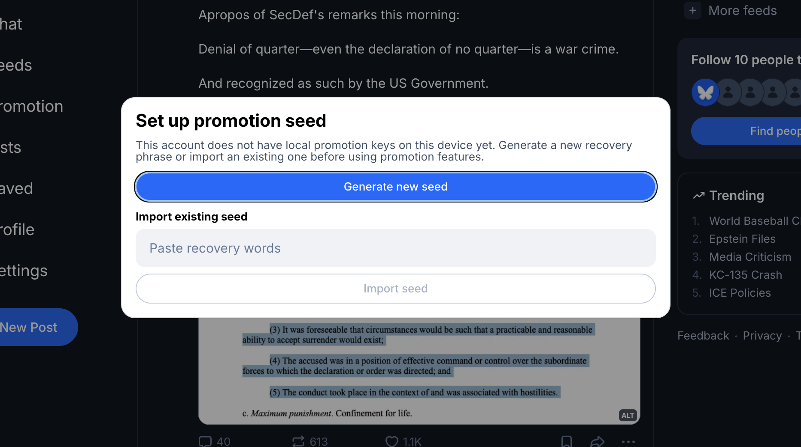

<div class="paper-meta">
  <div class="paper-authors">
    <strong>Ioannis Kaklamanis<sup>1</sup></strong>,
    <strong>Wenhao Wang<sup>1</sup></strong>,
    <strong>Harjasleen Malvai<sup>2</sup></strong>,
    <strong>Fan Zhang<sup>1</sup></strong>
  </div>

  <div class="paper-affiliations">
    <div><sup>1</sup> Yale University, IC3</div>
    <div><sup>2</sup> UIUC, IC3</div>
  </div>

  <div class="paper-links">
    <a class="btn btn-primary paper-link-btn" href="https://eprint.iacr.org/2025/2330">ePrint</a>
    <a class="btn btn-primary paper-link-btn" href="https://eprint.iacr.org/2025/2330.pdf">PDF</a>
    <!-- <span class="btn btn-primary paper-link-btn disabled" aria-disabled="true">Code coming soon</span> -->
    <!-- <span class="btn btn-primary paper-link-btn disabled" aria-disabled="true">Slides coming soon</span> -->
  </div>
</div>

## The Problem

Many important services are delivered by an intermediary, but the party paying for the service often has no trustworthy way to verify how many users were actually served. For example:

- In content economy platforms (e.g., social networks), a creator may pay for boosted views, but has little visibility into whether the promised number of views was actually delivered or simply self-reported.
- In sponsored health programs, a provider may claim reimbursement for serving a certain number of patients, creating a direct incentive to inflate counts if there is no reliable auditing mechanism.
- In BitTorrent-style reputation systems, an uploader may claim to have contributed more data than what really has been downloaded, distorting the incentives of the protocol.

Across these settings,
a fundamental security problem is to verify service quality,
e.g., how many eligible users were reached or how many
employees were actually served.


## Verifiable Aggregate Receipts (VAR)

VAR is the paper's answer to that gap. With VAR, a **platform** is given a *receipt* by users when they are served, and a verifier can cryptographic verify the number of receipts possessed by the platform through an interactive protocol.


That proof should be hard to fake (*inflation soundness*), should not reveal which individual users were involved (*privacy from verifier*), and should still be practical at the scale of millions of users.

- **Inflation soundness**: a prover should not be able to claim more engagement than it actually earned.
- **Privacy**: the verifier should learn only the count, not individual identities beyond what can be inferred from the count.
- **Deniability**: We don't like users to sign over their interactions with the platform because that violates "deniability" offered by most Internet applications.
- **Scalability**: we aim to efficiently support *millions* of users.

For those familiar with anonymous credentials, the core of VAR can be viewed as an aggregatable form of one-show anonymous credentials, though our constructions do not directly build on anonymous credentials.


### Two Constructions

The paper presents two complementary constructions.

- `S-VAR` is the secret-sharing-based construction. Its strength is simplicity and efficiency in issuance; it is a good fit when fuzzy thresholds are acceptable and fast issuance matters.
- `P-VAR` is the pairing-based construction. Its strength is exact auditing and faster proof generation, making it the stronger option when precise counts and fast audits are the priority.


The secret-sharing intuition is especially elegant: if reconstructing a secret requires enough shares, then successfully reconstructing it acts as evidence that the prover collected enough receipts.


We refer readers to [the paper]() for details.

### Benchmark results

The proposed constructions are practical, and they significantly outperform baseline approaches for large-scale audits.
For one million users, the paper reports:

**[Expand]**

- less than 2 seconds for issuance in both schemes,
- about 34 seconds for proving with the secret-sharing-based construction,
- about 9.7 seconds for proving with the pairing-based construction.


## A Concrete Application: TrueReach on Bluesky

We extended the BlueSky protocol with a feature we call **TrueReach**, where a content creator can use VAR to cryptographically verify the view counts.

### What is BlueSky, and why building VAR on it?

[[translate this into text]]


### Our implementation strategy

[How did we integrate with BlueSky, and why we did what we do]


[An overview of steps]


### Walk-through of a demo




## Highlights

- Introduces Verifiable Aggregate Receipts for privacy-preserving user engagement auditing.
- Presents two constructions: S-VAR for tiered fuzzy audits and P-VAR for exact audits.
- TruPromo on BlueSky

## Acknowledgements

We thank Sen Yang for building TrueReach!

## Citation

```bibtex
@article{kaklamanis2025var,
  title   = {Verifiable Aggregate Receipts with Applications to User Engagement Auditing},
  author  = {Kaklamanis, Ioannis and Wang, Wenhao and Malvai, Harjasleen and Zhang, Fan},
  journal = {Cryptology ePrint Archive},
  year    = {2025},
  url     = {https://eprint.iacr.org/2025/2330}
}
```
